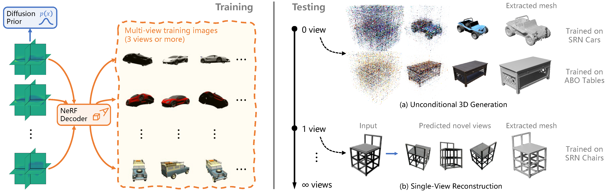

# SSDNeRF

**Single-Stage Diffusion NeRF: A Unified Approach to 3D Generation and Reconstruction**
 
[Hansheng Chen](https://lakonik.github.io/)1,\*, [Jiatao Gu](https://jiataogu.me/)2, [Anpei Chen](https://apchenstu.github.io/)3, [Wei Tian](https://scholar.google.com/citations?user=aYKQn88AAAAJ&hl=en)1, [Zhuowen Tu](https://pages.ucsd.edu/~ztu/)4, [Lingjie Liu](https://lingjie0206.github.io/)5, [Hao Su](https://cseweb.ucsd.edu/~haosu/)4 
1Tongji University, 2Apple, 3ETH Zurich, 4UCSD, 5University of Pennsylvania
 
\*Work done during a remote internship with UCSD.

[[project page](https://lakonik.github.io/ssdnerf)] [[paper](https://arxiv.org/pdf/2304.06714.pdf)]

The code for this project will be released here.
