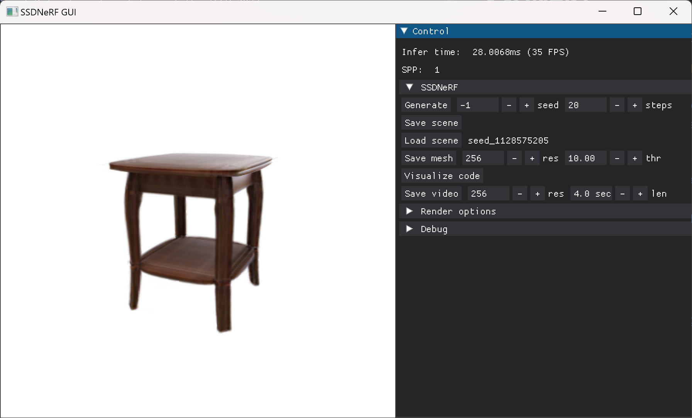

# SSDNeRF

Official PyTorch implementation of the ICCV 2023 paper:

**Single-Stage Diffusion NeRF: A Unified Approach to 3D Generation and Reconstruction**
<br>
[Hansheng Chen](https://lakonik.github.io/)<sup>1,</sup>\*, [Jiatao Gu](https://jiataogu.me/)<sup>2</sup>, [Anpei Chen](https://apchenstu.github.io/)<sup>3</sup>, [Wei Tian](https://scholar.google.com/citations?user=aYKQn88AAAAJ&hl=en)<sup>1</sup>, [Zhuowen Tu](https://pages.ucsd.edu/~ztu/)<sup>4</sup>, [Lingjie Liu](https://lingjie0206.github.io/)<sup>5</sup>, [Hao Su](https://cseweb.ucsd.edu/~haosu/)<sup>4</sup><br>
<sup>1</sup>Tongji University, <sup>2</sup>Apple, <sup>3</sup>ETH Zürich, <sup>4</sup>UCSD, <sup>5</sup>University of Pennsylvania
<br>
\*Work done during a remote internship with UCSD.

[[project page](https://lakonik.github.io/ssdnerf)] [[paper](https://arxiv.org/pdf/2304.06714.pdf)]

Part of this codebase is based on [torch-ngp](https://github.com/ashawkey/torch-ngp) and [MMGeneration](https://github.com/open-mmlab/mmgeneration).
<br>

https://github.com/Lakonik/SSDNeRF/assets/53893837/22e7ee6c-7576-44f2-b408-41089180e359

## Highlights

- Code to reproduce ALL the experiments in the paper and supplementary material (including single-view reconstruction on the real KITTI Cars dataset).
<br>
- New features including support for tiled triplanes (rollout layout), FP16 diffusion sampling, and 16-bit caching.
- A simple GUI demo (modified from [torch-ngp](https://github.com/ashawkey/torch-ngp)).
<br>

## Installation

### Prerequisites

The code has been tested in the environment described as follows:

- Linux (tested on Ubuntu 18.04/20.04 LTS)
- Python 3.7
- [CUDA Toolkit](https://developer.nvidia.com/cuda-toolkit-archive) 11
- [PyTorch](https://pytorch.org/get-started/previous-versions/) 1.12.1
- [MMCV](https://github.com/open-mmlab/mmcv) 1.6.0
- [MMGeneration](https://github.com/open-mmlab/mmgeneration) 0.7.2

Also, this codebase should be able to work on Windows systems as well (tested in the inference mode).

Other dependencies can be installed via `pip install -r requirements.txt`. 

An example of commands for installing the Python packages is shown below:

```bash
# Export the PATH of CUDA toolkit
export PATH=/usr/local/cuda-11.3/bin:$PATH
export LD_LIBRARY_PATH=/usr/local/cuda-11.3/lib64:$LD_LIBRARY_PATH

# Create conda environment
conda create -y -n ssdnerf python=3.7
conda activate ssdnerf

# Install PyTorch (this script is for CUDA 11.3)
conda install pytorch==1.12.1 torchvision==0.13.1 torchaudio==0.12.1 cudatoolkit=11.3 -c pytorch

# Install MMCV and MMGeneration
pip install -U openmim
mim install mmcv-full==1.6
git clone https://github.com/open-mmlab/mmgeneration && cd mmgeneration && git checkout v0.7.2
pip install -v -e .
cd ..

# Clone this repo and install other dependencies
git clone <this repo> && cd <repo folder>
pip install -r requirements.txt
```

### Compile CUDA packages

There are two CUDA packages from [torch-ngp](https://github.com/ashawkey/torch-ngp) that need to be built locally.

```bash
cd lib/ops/raymarching/
pip install -e .
cd ../shencoder/
pip install -e .
cd ../../..
```

## Data preparation

Download `srn_cars.zip` and `srn_chairs.zip` from [here](https://drive.google.com/drive/folders/1PsT3uKwqHHD2bEEHkIXB99AlIjtmrEiR).
Unzip them to `./data/shapenet`.

Download `abo_tables.zip` from [here](https://drive.google.com/file/d/1lzw3uYbpuCxWBYYqYyL4ZEFomBOUN323/view?usp=share_link). Unzip it to `./data/abo`. For convenience I have converted the ABO dataset into PixelNeRF's SRN format.

If you want to try single-view reconstruction on the real KITTI Cars dataset, please download the official [KITTI 3D object dataset](http://www.cvlibs.net/datasets/kitti/eval_object.php?obj_benchmark=3d), including [left color images](http://www.cvlibs.net/download.php?file=data_object_image_2.zip), [calibration files](http://www.cvlibs.net/download.php?file=data_object_calib.zip), [training labels](http://www.cvlibs.net/download.php?file=data_object_label_2.zip), and [instance segmentations](https://github.com/HeylenJonas/KITTI3D-Instance-Segmentation-Devkit).

Extract the downloaded archives according to the following folder tree (or use symlinks).

```
./
├── configs/
├── data/
│   ├── shapenet/
│   │   ├── cars_test/
│   │   ├── cars_train/
│   │   ├── cars_val/
│   │   ├── chairs_test/
│   │   ├── chairs_train/
│   │   └── chairs_val/
│   ├── abo/
│   │   ├── tables_train/
│   │   └── tables_test/
│   └── kitti/
│       └── training/
│           ├── calib/
│           ├── image_2/
│           ├── label_2/
|           └── instance_2/
├── demo/
├── lib/
├── tools/
…
```

For FID and KID evaluation, run the following commands to extract the Inception features of the real images. (This script will use all the available GPUs on your machine, so remember to set `CUDA_VISIBLE_DEVICES`.)

```bash
CUDA_VISIBLE_DEVICES=0 python tools/inception_stat.py configs/paper_cfgs/ssdnerf_cars_uncond.py
CUDA_VISIBLE_DEVICES=0 python tools/inception_stat.py configs/paper_cfgs/ssdnerf_chairs_recons1v.py
CUDA_VISIBLE_DEVICES=0 python tools/inception_stat.py configs/paper_cfgs/ssdnerf_abotables_uncond.py
```

For KITTI Cars preprocessing, run the following command.

```bash
python tools/kitti_preproc.py
```

## About the configs

### Naming convention
    
```
ssdnerf_cars3v_uncond
   │      │      └── testing data: test unconditional generation
   │      └── training data: train on Cars dataset, using 3 views per scene
   └── training method: single-stage diffusion nerf training
  
stage2_cars_recons1v
   │     │      └── testing data: test 3D reconstruction from 1 view
   │     └── training data: train on Cars dataset, using all views per scene
   └── training method: stage 2 of two-stage training
```

### Models in the main paper

| Config                                                                     |                                           Checkpoint                                            | Iters  |     FID      | LPIPS | Comments                                                                                                                                                        |
|:---------------------------------------------------------------------------|:-----------------------------------------------------------------------------------------------:|:------:|:------------:|:-----:|:----------------------------------------------------------------------------------------------------------------------------------------------------------------|
| [ssdnerf_cars_uncond](configs/paper_cfgs/ssdnerf_cars_uncond.py)           | [gdrive](https://drive.google.com/file/d/1tZMzfauuB7mo3vc_ojNoiHS5kC4DfBF6/view?usp=drive_link) |   1M   | 11.08 ± 1.11 |   -   |                                                                                                                                                                 |
| [ssdnerf_abotables_uncond](configs/paper_cfgs/ssdnerf_abotables_uncond.py) | [gdrive](https://drive.google.com/file/d/1AnVELtHRxBE8Hd-KssYlOcQMpNbzD68M/view?usp=drive_link) |   1M   | 14.27 ± 0.66 |   -   |                                                                                                                                                                 |
| [ssdnerf_cars_recons1v](configs/paper_cfgs/ssdnerf_cars_recons1v.py)       | [gdrive](https://drive.google.com/file/d/1hsnUW7dZ45aPqXxtOVrOSBl1gQA_8wH-/view?usp=drive_link) |  80K   |    16.39     | 0.078 |                                                                                                                                                                 |
| [ssdnerf_chairs_recons1v](configs/paper_cfgs/ssdnerf_chairs_recons1v.py)   | [gdrive](https://drive.google.com/file/d/1ZvU361JyuIKp6dmhPivdB-18srh5xbsI/view?usp=drive_link) |  80K   |    10.13     | 0.067 |                                                                                                                                                                 |
| [ssdnerf_cars3v_uncond_1m](configs/paper_cfgs/ssdnerf_cars3v_uncond_1m.py) |                                                                                                 |   1M   |              |   -   | The first half of training before resetting the triplanes.                                                                                                      |
| [ssdnerf_cars3v_uncond_2m](configs/paper_cfgs/ssdnerf_cars3v_uncond_2m.py) | [gdrive](https://drive.google.com/file/d/1DxpiPAa-pPxjrxhK_DXgJvk2JOgd-WWv/view?usp=drive_link) |   1M   | 19.04 ± 1.10 |   -   | The second half of training after resetting the triplanes (requires training [ssdnerf_cars3v_uncond_1m](configs/paper_cfgs/ssdnerf_cars3v_uncond_1m.py) first). |
| [ssdnerf_cars3v_recons1v](configs/paper_cfgs/ssdnerf_cars3v_recons1v.py)   |                                                                                                 |  80K   |              | 0.106 |                                                                                                                                                                 |
| [stage1_cars_recons16v](configs/paper_cfgs/stage1_cars_recons16v.py)       |                                                                                                 |  400K  |              |       | Ablation study, NeRF reconstruction stage.                                                                                                                      |
| [stage2_cars_uncond](configs/paper_cfgs/stage2_cars_uncond.py)             |                                                                                                 |   1M   | 16.33 ± 0.93 |   -   | Ablation study, diffusion stage (requires training [stage1_cars_recons16v](configs/paper_cfgs/stage1_cars_recons16v.py) first).                                 |
| [stage2_cars_recons1v](configs/paper_cfgs/stage2_cars_recons1v.py)         |                                                                                                 |  80K   |    20.97     | 0.090 | Ablation study, diffusion stage (requires training [stage1_cars_recons16v](configs/paper_cfgs/stage1_cars_recons16v.py) first).                                 |

### Models in the supplementary material

| Config                                                                            | Iters |  FID  | LPIPS | Comments                                                                                                                                        |
|:----------------------------------------------------------------------------------|:-----:|:-----:|:-----:|:------------------------------------------------------------------------------------------------------------------------------------------------|
| [ssdnerf_cars_reconskitti](configs/supp_cfgs/ssdnerf_cars_reconskitti.py)         |  80K  |   -   |   -   | Same model as [ssdnerf_cars_recons1v](configs/paper_cfgs/ssdnerf_cars_recons1v.py) except for being tested on real images of the KITTI dataset. |
| [ssdnerf_cars_recons1v_notanh](configs/supp_cfgs/ssdnerf_cars_recons1v_notanh.py) |  80K  | 16.34 | 0.077 | Without tanh latent code activation.                                                                                                            |                                                                                                                       |                                                                                                                                             |
| [ssdnerf_cars_recons1v_noreg](configs/supp_cfgs/ssdnerf_cars_recons1v_noreg.py)   |  80K  | 16.62 | 0.077 | Without L2 latent code regularization.                                                                                                          |

### New models in this repository

The new models feature **improved implementations**, including the following changes:

- Use `NormalizedTanhCode` instead of `TanhCode` activation, which helps stablizing the scale (std) of the latent codes. Scale normalization is no longer required in the DDPM MSE loss. Latent code lr is rescaled accordingly.
- Remove L2 latent code regularizaiton.
- Disable U-Net dropout in `recons` models.
- `uncond` and `recons` models are now exactly the same except for training schedules and testing configs.
- Enable new features such as 16-bit caching and tiled triplanes.

*Note: It is highly recommended to start with these new models if you want to train custom models. The original models in the paper are retained only for reproducibility.*

| Config                                                                                               | Iters | Comments                                                                                                                                                                                  |
|:-----------------------------------------------------------------------------------------------------|:-----:|:------------------------------------------------------------------------------------------------------------------------------------------------------------------------------------------|
| [ssdnerf_cars_uncond_16bit](configs/new_cfgs/ssdnerf_cars_uncond_16bit.py)                           |  1M   | Enable 16-bit caching. Should yield similar results to [ssdnerf_cars_uncond](configs/paper_cfgs/ssdnerf_cars_uncond.py).                                                                  |
| [ssdnerf_cars_recons1v_16bit](configs/new_cfgs/ssdnerf_cars_recons1v_16bit.py)                       |  60K  | Enable 16-bit caching. Should yield similar results to [ssdnerf_cars_recons1v](configs/paper_cfgs/ssdnerf_cars_recons1v.py).                                                              |                                                                                               |                                                                                                                       |                                                                                                                                             |
| [ssdnerf_cars_recons1v_tiled](configs/new_cfgs/ssdnerf_cars_recons1v_tiled.py)                       | 100K  | Use tiled (rollout) triplane layout. Tiled triplanes could have resulted in higher computation cost, but in this model the UNet channels have been reduced to compensate for the runtime. |
| [stage1_cars_recons16v_16bit](configs/new_cfgs/stage1_cars_recons16v_16bit.py)                       | 400K  | Enable 16-bit caching. Should yield similar results to [stage1_cars_recons16v](configs/paper_cfgs/stage1_cars_recons16v.py).                                                              |
| [stage1_cars_recons16v_16bit_filesystem](configs/new_cfgs/stage1_cars_recons16v_16bit_filesystem.py) | 400K  | Same as [stage1_cars_recons16v_16bit](configs/new_cfgs/stage1_cars_recons16v_16bit) but caching on filesystem, in case your RAM is full. Not recommended due to slow I/O on hard drives.  |

### Unused features in this codebase

- This codebase supports concat-based image conditioning, although it's not used in the above models.

### Todos

- [ ] Add multi-view reconstruction testing configs.

## Training

Run the following command to train a model:

```bash
python train.py /PATH/TO/CONFIG --gpu-ids 0 1
```

Note that the total batch size is determined by the number of GPUs you specified. All our models are trained using 2 RTX 3090 (24G) GPUs.

Since we adopt the density-based NeRF pruning trategy in [torch-ngp](https://github.com/ashawkey/torch-ngp), training would start slow and become faster later, so the initial esitamtion of remaining time is usually over twice as much as the actual training time.

Model checkpoints will be saved into `./work_dirs`. Scene caches will be saved into `./cache`.

## Testing and evaluation

```bash
python test.py /PATH/TO/CONFIG /PATH/TO/CHECKPOINT --gpu-ids 0 1  # you can specify any number of GPUs here
```
Some trained models can be downloaded from [here](https://drive.google.com/drive/folders/13z4C13TsofPkBuqMqQjRp5yDck7CjCiZ?usp=sharing) for testing.

To save the sampled NeRFs and extracted meshes, uncomment (or add) these lines in the `test_cfg` dict of the config file:

```python
    save_dir=work_dir + '/save',
    save_mesh=True,
    mesh_resolution=256,
    mesh_threshold=10,
```

All results will be saved into `./work_dirs/<cfg name>/save`.
You can then open the saved `.pth` NeRF scenes using the GUI tool `demo/ssdnerf_gui.py` (see below), and the `.stl` meshes using any mesh viewer.

## Visualization

By default, during training or testing, the visualizations will be saved into `./work_dirs`. 

A GUI tool is provided for visualizing the results (currently only supports unconditional generation or loading saved `.pth` NeRF scenes). Run the following command to start the GUI:

```bash
python demo/ssdnerf_gui.py /PATH/TO/CONFIG /PATH/TO/CHECKPOINT --fp16
```

## Citation

If you find this project useful in your research, please consider citing:

```
@inproceedings{ssdnerf,
    title={Single-Stage Diffusion NeRF: A Unified Approach to 3D Generation and Reconstruction}, 
    author={Hansheng Chen and Jiatao Gu and Anpei Chen and Wei Tian and Zhuowen Tu and Lingjie Liu and Hao Su},
    year={2023},
    booktitle={ICCV}
}
```
